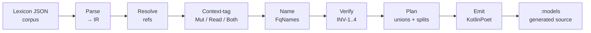

# atproto-kotlin

Code-generated [AT Protocol](https://atproto.com) Kotlin Multiplatform SDK
for Bluesky and atproto apps. Parses the upstream `@atproto/lex` lexicon
corpus at build time and emits idiomatic Kotlin: immutable `data class`
records, sealed-equivalent open unions with `$type` dispatch, typed value
classes for every string format, and `suspend fun` XRPC service interfaces
ready to drop into a Ktor client.

[](https://github.com/kikin81/atproto-kotlin/actions/workflows/ci.yaml)
[](https://github.com/kikin81/atproto-kotlin/actions/workflows/release.yaml)
[](https://central.sonatype.com/artifact/io.github.kikin81.atproto/runtime)
[](https://github.com/kikin81/atproto-kotlin/releases/latest)
[](https://opensource.org/licenses/MIT)
[](https://kikin81.github.io/atproto-kotlin/api/)

## Modules

| Module | What it is |
| --- | --- |
| `:runtime` | KMP library (JVM + iOS) holding the hand-written base: typed value classes for every string format (`Did`, `Handle`, `AtUri`, `Cid`, `Datetime`, …), `sealed AtField<T>` for three-state optionality on mutation paths, `OpenUnionSerializer<T>` + `UnknownOpenUnionMember` for open-union `$type` dispatch, typed `Blob` + `CidLink`, and an `XrpcClient` built on Ktor with a pluggable `AuthProvider`. |
| `:generator` | JVM-only code generator. Parses the lexicon JSON corpus, resolves refs, tags mutation/read usage contexts, runs a verification pass (INV-1..4 + pair-keyed collision overrides), then emits idiomatic Kotlin via KotlinPoet: records, sealed-equivalent open unions, request/response pairs for queries and procedures, and `<Namespace>Service` classes wrapping `XrpcClient`. |
| `:models` | KMP library that picks up the generator's output at build time via `:generator:generateModels`. This is what downstream consumers depend on. |
| `:oauth` | JVM library implementing AT Protocol OAuth 2.0 for public clients: handle/DID/PDS/auth-server discovery, PAR with PKCE (S256) + DPoP (EC P-256), browser-based authorization, token exchange, and transparent refresh with DPoP-bound rotation. See [`oauth/README.md`](oauth/README.md). |
| `:compose` | Android library with Jetpack Compose helpers for rendering Bluesky post text + `app.bsky.richtext.facet` annotations as a correctly-styled `AnnotatedString`. Bullet-proof UTF-8 byte → UTF-16 char mapping. **No Material dependency** — bring your own design system. See [`compose/README.md`](compose/README.md). |
| `:compose-material3` | Optional add-on with a one-line `@Composable rememberBlueskyAnnotatedString` that defaults link styling to `MaterialTheme.colorScheme.primary`. Layered on top of `:compose`. See [`compose-material3/README.md`](compose-material3/README.md). |
| `:samples:android` | **Reference consumer.** A minimal Compose app that authenticates via OAuth 2.0 + DPoP and renders a Bluesky timeline using `:compose-material3` for facet rendering. Dogfoods the generated API surface, the OAuth module, and the Compose helpers end-to-end. See [`samples/android/README.md`](samples/android/README.md). |

### Codegen pipeline

The `:generator` module's seven stages, end to end:



Each stage is a separate pass with its own tests. The verification pass
enforces invariants (no name collisions, no unresolved refs) before any
KotlinPoet emission, so generator errors fail fast with actionable
messages instead of producing broken Kotlin downstream.

## Sample app

The Android reference consumer lives at [`samples/android/`](samples/android/).
It authenticates via **AT Protocol OAuth 2.0** (PAR + PKCE + DPoP) using
Chrome Custom Tabs and renders a feed from `app.bsky.feed.getTimeline`.

```bash
./gradlew :samples:android:installDebug
```

See [`samples/android/README.md`](samples/android/README.md) for run
instructions and architecture details.

## Getting started as a contributor

```bash
# 1. Install the upstream lexicon corpus (pinned by CID in lexicons.json).
cd generator && npx lex install --ci && cd -

# 2. Run the whole test suite (runtime, generator, sample, golden files).
./gradlew build
```

Local prerequisites: **JDK 17** (tracked by `.java-version` / `.sdkmanrc`),
**Node 22+** (for `npx lex install`), and the **Android SDK** if you want to
build the sample. Spotless + ktlint run on every commit via pre-commit hooks
and on every push via the CI workflow.

## Consuming the library

Every release is published to **Maven Central** ([`io.github.kikin81.atproto`](https://central.sonatype.com/namespace/io.github.kikin81.atproto))
and simultaneously to **GitHub Packages** as a secondary channel. For
almost every consumer, Maven Central is what you want — no credentials,
no extra repository configuration.

```kotlin
// settings.gradle.kts
dependencyResolutionManagement {
    repositories {
        mavenCentral()
    }
}
```

```kotlin
// build.gradle.kts (or the KMP module's common source set)
dependencies {
    implementation("io.github.kikin81.atproto:runtime:<version>")
    implementation("io.github.kikin81.atproto:models:<version>")
    implementation("io.github.kikin81.atproto:oauth:<version>") // OAuth 2.0 + DPoP
    implementation("io.github.kikin81.atproto:compose:<version>") // Android: facet → AnnotatedString
    implementation("io.github.kikin81.atproto:compose-material3:<version>") // Android: Material 3 default
}
```

Replace `<version>` with the
[latest release](https://github.com/kikin81/atproto-kotlin/releases/latest)
version. Artifacts are GPG-signed and include POM metadata, Gradle
Module Metadata, sources JARs, and Dokka-generated javadoc JARs.

**iOS** consumers: only JVM + metadata publications are cut from Linux
CI runners today. The Kotlin Multiplatform Gradle Module Metadata
describes the JVM target and allows iOS consumers to resolve the
runtime dependency graph, but the iOS klibs themselves aren't on
Maven Central yet. A macOS release runner will land in a follow-up.

### GitHub Packages (pre-release / staging)

Every release is also pushed to [GitHub Packages](https://github.com/kikin81/atproto-kotlin/packages)
as a secondary channel. This is mostly useful if you want to pick up
the exact same artifacts without routing through Maven Central's CDN,
or for early-access testing of unreleased builds. **It requires
authentication with a GitHub PAT (`read:packages` scope) even for
public packages** — a persistent GitHub Packages limitation. Most
consumers should stick with Maven Central.

```kotlin
maven {
    url = uri("https://maven.pkg.github.com/kikin81/atproto-kotlin")
    credentials {
        username = System.getenv("GITHUB_ACTOR") ?: "<your-github-username>"
        password = System.getenv("GITHUB_TOKEN") ?: "<your-pat-with-read-packages>"
    }
}
```

## Migrating from 4.x

**5.0.0 renames every published artifactId** to drop the redundant
`at-protocol-` prefix. The group (`io.github.kikin81.atproto`) is
unchanged. No consumer code changes are required — only the coordinate
strings in your build file.

```kotlin
// before (4.x)
implementation("io.github.kikin81.atproto:at-protocol-runtime:4.9.0")
implementation("io.github.kikin81.atproto:at-protocol-models:4.9.0")
implementation("io.github.kikin81.atproto:at-protocol-oauth:4.9.0")

// after (5.0.0+)
implementation("io.github.kikin81.atproto:runtime:5.0.0")
implementation("io.github.kikin81.atproto:models:5.0.0")
implementation("io.github.kikin81.atproto:oauth:5.0.0")
```

The 4.x artifacts remain on Maven Central (they're immutable) but
receive no further updates. Pin to 5.0.0+ to pick up new releases.

## Releases

Every push to `main` runs through `.github/workflows/release.yaml`, which
drives [`semantic-release`](https://semantic-release.gitbook.io/) via
`open-turo/actions-jvm/release`. The commit-analyzer reads
[Conventional Commits](https://www.conventionalcommits.org/) and cuts a
version on `feat:` / `fix:` / `BREAKING CHANGE`:

- `feat:` → minor bump (e.g. `1.1.2 → 1.2.0`)
- `fix:` → patch bump (e.g. `1.1.2 → 1.1.3`)
- `BREAKING CHANGE:` footer → major bump
- `chore:` / `ci:` / `docs:` / `test:` / `refactor:` → no release

The release workflow runs gate jobs (`lint`, `test`, `build`) that
mirror CI, and only then runs the **release** job: semantic-release
analyzes commits, bumps `gradle.properties`, creates a git tag + GitHub
release, then runs `./gradlew publish` via the
`gradle-semantic-release-plugin` to upload artifacts to **both** GitHub
Packages and Maven Central (via the
[vanniktech maven-publish plugin](https://vanniktech.github.io/gradle-maven-publish-plugin/)).
A final docs job rebuilds the Dokka API reference and pushes it to
GitHub Pages.

Central uploads auto-promote to `repo1.maven.org` — no manual step
needed. Artifacts are typically available within 15–30 minutes of a
release.

## OpenSpec

This project uses [OpenSpec](https://github.com/kikin81/openspec)-style
change proposals under [`openspec/`](openspec/). Active work lives under
`openspec/changes/<name>/` with `proposal.md` + `design.md` +
`specs/<capability>/spec.md` + `tasks.md`; archived changes land under
`openspec/changes/archive/<date>-<name>/` and their requirements are
promoted into permanent main specs at `openspec/specs/<capability>/`.

Run `openspec list` to see active + archived changes, or
`openspec status --change <name>` for artifact-level progress.

## Contributing

PRs welcome. Read [`CONTRIBUTING.md`](CONTRIBUTING.md) for the quick-start
build, the per-module verification commands, and the Conventional Commits
expectations (since `feat:` / `fix:` on `main` cuts a release).

For non-trivial changes, open an issue first — GitHub auto-applies a
[bug report](.github/ISSUE_TEMPLATE/bug_report.md) or
[feature request](.github/ISSUE_TEMPLATE/feature_request.md) template
when you click **New issue**. Pull requests likewise pre-populate from
[`PULL_REQUEST_TEMPLATE.md`](.github/PULL_REQUEST_TEMPLATE.md) — fill in
the affected-module checklist and the "How it was verified" section.

Larger architectural work goes through the
[OpenSpec](#openspec) workflow described above; `CONTRIBUTING.md`
explains when that's required.

## License

[MIT](LICENSE) © 2026 Francisco Velazquez. See [`LICENSE`](LICENSE) for the
full text.
