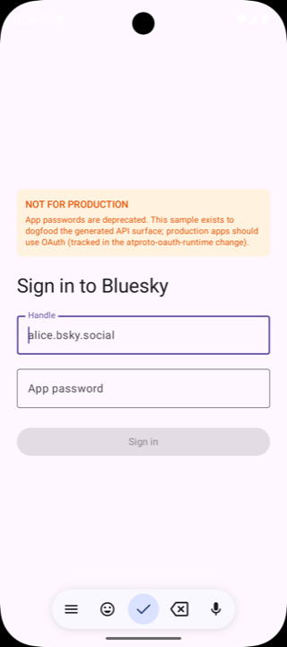

# atproto-kotlin

Code-generated [AT Protocol](https://atproto.com) Kotlin Multiplatform SDK
for Bluesky and atproto apps. Parses the upstream `@atproto/lex` lexicon
corpus at build time and emits idiomatic Kotlin: immutable `data class`
records, sealed-equivalent open unions with `$type` dispatch, typed value
classes for every string format, and `suspend fun` XRPC service interfaces
ready to drop into a Ktor client.

[](https://github.com/kikin81/atproto-kotlin/actions/workflows/ci.yaml)
[](https://github.com/kikin81/atproto-kotlin/actions/workflows/release.yaml)
[](https://github.com/kikin81/atproto-kotlin/releases/latest)
[](https://opensource.org/licenses/MIT)

## Modules

| Module | What it is |
| --- | --- |
| `:at-protocol-runtime` | KMP library (JVM + iOS) holding the hand-written base: typed value classes for every string format (`Did`, `Handle`, `AtUri`, `Cid`, `Datetime`, …), `sealed AtField<T>` for three-state optionality on mutation paths, `OpenUnionSerializer<T>` + `UnknownOpenUnionMember` for open-union `$type` dispatch, typed `Blob` + `CidLink`, and an `XrpcClient` built on Ktor with a pluggable `AuthProvider`. |
| `:at-protocol-generator` | JVM-only code generator. Parses the lexicon JSON corpus, resolves refs, tags mutation/read usage contexts, runs a verification pass (INV-1..4 + pair-keyed collision overrides), then emits idiomatic Kotlin via KotlinPoet: records, sealed-equivalent open unions, request/response pairs for queries and procedures, and `<Namespace>Service` classes wrapping `XrpcClient`. |
| `:at-protocol-models` | KMP library that picks up the generator's output at build time via `:at-protocol-generator:generateModels`. This is what downstream consumers depend on. |
| `:samples:android` | **Reference consumer.** A minimal Compose app that logs in to Bluesky and renders a timeline end-to-end. Dogfoods every interesting part of the generated API surface: `AtField`, open unions on embeds, typed `Blob`, `Datetime`, XRPC service classes. See [`samples/android/README.md`](samples/android/README.md). |

## Sample app

The Android reference consumer lives at [`samples/android/`](samples/android/).
It authenticates via the deprecated app-password flow (a stopgap — OAuth is
tracked as a separate follow-up) and renders a feed from
`app.bsky.feed.getTimeline`. **Do not ship a production app built on this
sample's auth flow.**

<table>
  <tr>
    <th width="50%">Login</th>
    <th width="50%">Feed</th>
  </tr>
  <tr>
    <td></td>
    <td></td>
  </tr>
</table>

```bash
./gradlew :samples:android:installDebug
```

See [`samples/android/README.md`](samples/android/README.md) for run
instructions and known v1 limitations.

## Getting started as a contributor

```bash
# 1. Install the upstream lexicon corpus (pinned by CID in lexicons.json).
cd at-protocol-generator && npx lex install --ci && cd -

# 2. Run the whole test suite (runtime, generator, sample, golden files).
./gradlew build
```

Local prerequisites: **JDK 17** (tracked by `.java-version` / `.sdkmanrc`),
**Node 22+** (for `npx lex install`), and the **Android SDK** if you want to
build the sample. Spotless + ktlint run on every commit via pre-commit hooks
and on every push via the CI workflow.

## Consuming from GitHub Packages (interim)

Released artifacts are currently published to **GitHub Packages** as an
interim distribution channel while Sonatype Maven Central publishing is
set up. GitHub Packages requires consumers to authenticate even for public
packages, so you'll need a GitHub PAT with `read:packages` scope.

```kotlin
// settings.gradle.kts
dependencyResolutionManagement {
    repositories {
        mavenCentral()
        maven {
            url = uri("https://maven.pkg.github.com/kikin81/atproto-kotlin")
            credentials {
                username = System.getenv("GITHUB_ACTOR") ?: "<your-github-username>"
                password = System.getenv("GITHUB_TOKEN") ?: "<your-pat-with-read-packages>"
            }
        }
    }
}
```

```kotlin
// build.gradle.kts
dependencies {
    implementation("io.github.kikin81.atproto:at-protocol-runtime:$version")
    implementation("io.github.kikin81.atproto:at-protocol-models:$version")
}
```

Replace `$version` with the current [latest release](https://github.com/kikin81/atproto-kotlin/releases/latest).
Only JVM + metadata publications are cut on Linux CI; iOS klib
publications are deferred to Maven Central.

## Releases

Every push to `main` runs through `.github/workflows/release.yaml`, which
drives [`semantic-release`](https://semantic-release.gitbook.io/) via
`open-turo/actions-jvm/release`. The commit-analyzer reads
[Conventional Commits](https://www.conventionalcommits.org/) and cuts a
version on `feat:` / `fix:` / `BREAKING CHANGE`:

- `feat:` → minor bump (e.g. `1.0.2 → 1.1.0`)
- `fix:` → patch bump (e.g. `1.0.2 → 1.0.3`)
- `BREAKING CHANGE:` footer → major bump
- `chore:` / `ci:` / `docs:` / `test:` / `refactor:` → no release

The same release job runs `./gradlew publish` against GitHub Packages via
the `gradle-semantic-release-plugin`, so one workflow invocation handles
version bump → git tag → GitHub release → Maven artifact upload.

## OpenSpec

This project uses [OpenSpec](https://github.com/kikin81/openspec)-style
change proposals under [`openspec/`](openspec/). Active work lives under
`openspec/changes/<name>/` with `proposal.md` + `design.md` +
`specs/<capability>/spec.md` + `tasks.md`; archived changes land under
`openspec/changes/archive/<date>-<name>/` and their requirements are
promoted into permanent main specs at `openspec/specs/<capability>/`.

Run `openspec list` to see active + archived changes, or
`openspec status --change <name>` for artifact-level progress.

## License

[MIT](LICENSE) — see the `LICENSE` file at the repo root. (TODO: add the
LICENSE file itself before the first Sonatype publish.)
